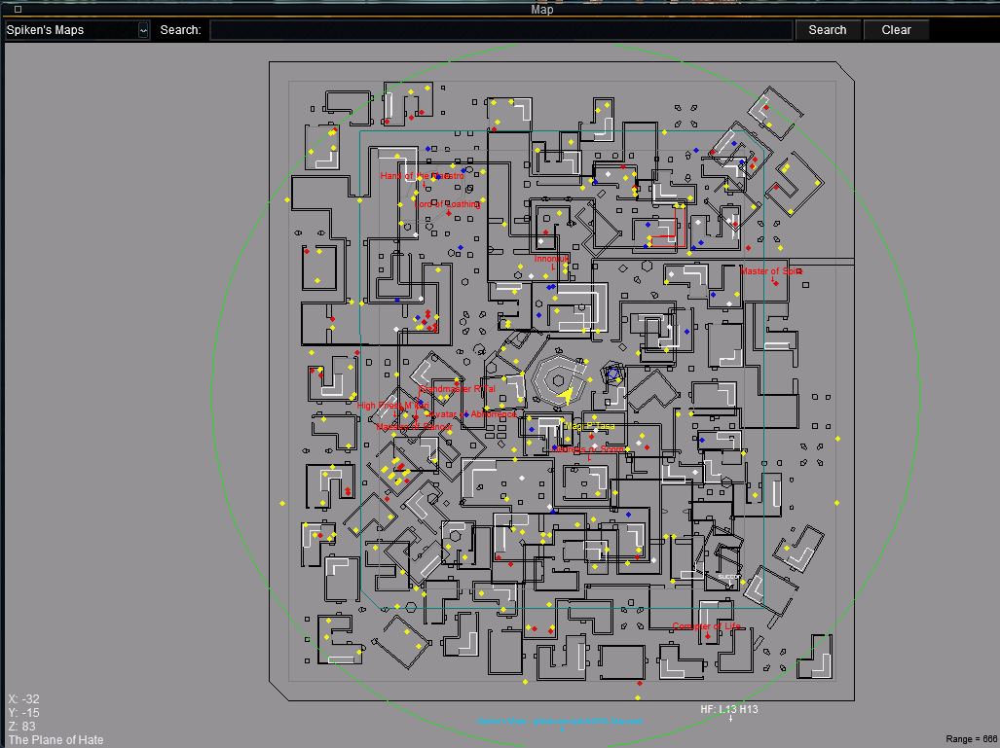
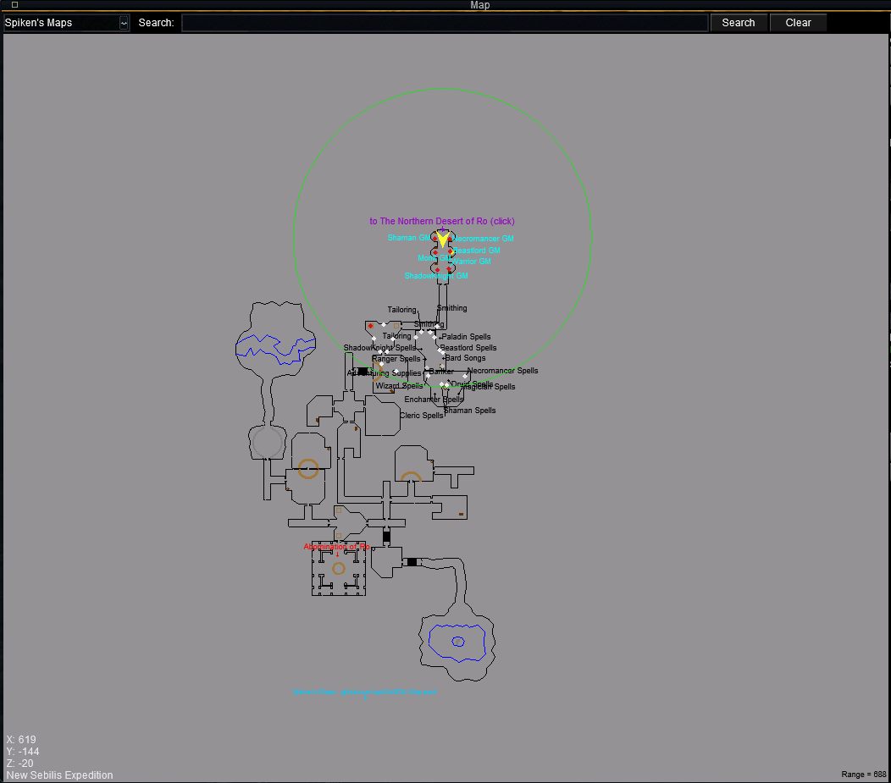
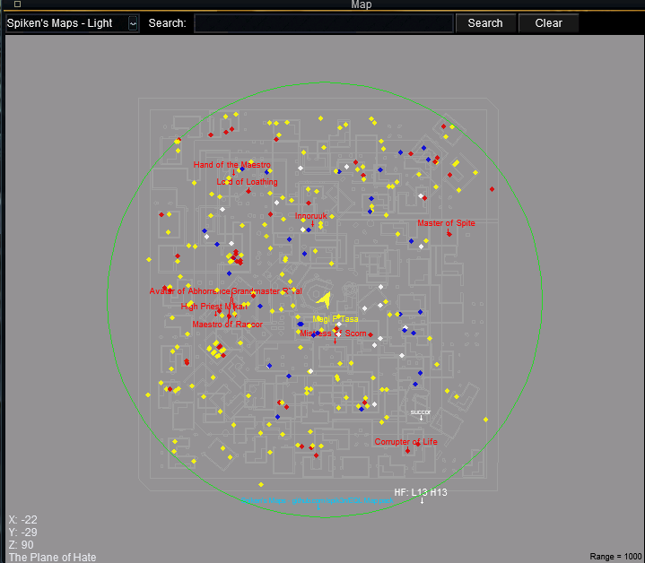
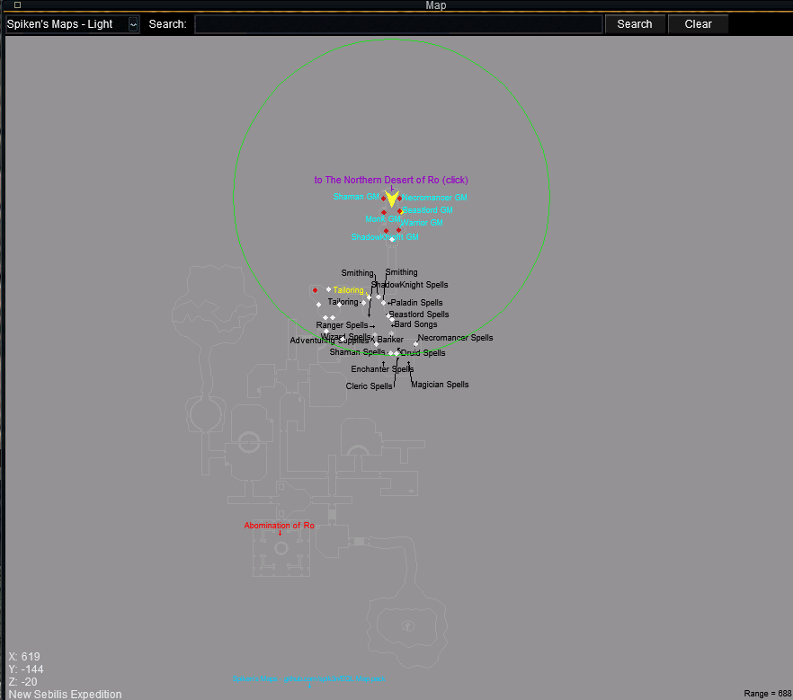
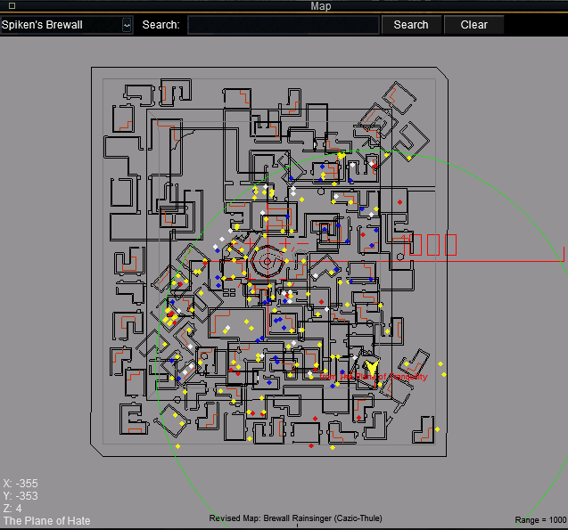
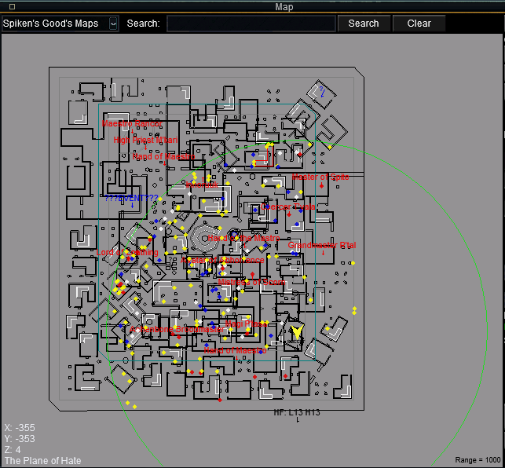

# Spiken's EQL Map Pack

In-game map packs for **EverQuest: Legends (EQL)**, in three styles, plus an optional
see-through overlay UI and a one-click installer.

Every pack is **updated for EQL**: the geometry matches the current EQL client, and the
~20 custom / instanced Legends zones the community packs never had (e.g. `lakenerius`,
`arena2`, the Plane-of-Hate revamp interiors) are included.

> **Quick install:** download **`Spikens-EQL-Map-Pack.zip`** from the latest release, run
> **`Install.bat`** (**no Python needed** — it uses built-in Windows PowerShell), pick a pack +
> (optional) overlay, and point it at your EQL folder. Prefer to copy files by hand? See
> **[Manual install](#manual-install-no-installer)**. Details below.

---

## The packs at a glance

| Pack | Style | POIs |
|------|-------|------|
| **Spiken's Maps** | Clean geometry, our own style | Zone lines, landmarks, vendors **+ named / rare / boss spawn markers** |
| **Spiken's Maps - Light** | Same, light-gray lines | Same as above (for dark-background / overlay use) |
| **Spiken's Brewall** | Brewall's look | Brewall's original POIs |
| **Spiken's Good's Maps** | Good's look | Good's original POIs |

Pick whichever you like — they install side by side, and you switch between them from the
map window's **top-left dropdown** in game.

---

## Spiken's Maps

Our own pack. Clean, EQL-accurate line work (see Credits) with a rich, colour-coded points
-of-interest layer built specifically for EQL.

**What's on it**

- **Zone connections** — every `to <zone>` line, in **purple**
- **Vendors / NPCs** — merchants, bankers, bartenders, etc., in **black**
- **Landmarks** — spires, druid rings, tradeskill spots, etc., in **white**
- **Spawn markers** for the mobs you actually care about:

| Colour | Meaning |
|--------|---------|
| 🔴 **Red** | Raid bosses |
| 🟠 **Orange** | Epic 1.0 quest mobs |
| 🟡 **Yellow** | Named / rare spawns |
| 🔵 **Cyan** | GuildMasters / class trainers |

**How the spawn data is sourced** — spawn locations come from **EQEMU** POI data (the open
EverQuest emulator database), which EQL's classic-era content closely matches. Only genuine
named/rare/boss spawns are shown (generic trash and static guards/summoned NPCs are filtered
out), one marker per mob, and overlapping labels at a shared camp are spread apart so they
stay readable.

For the **custom EQL zones** that don't exist on classic databases (e.g. New Sebilis Expedition)
and for **GuildMaster / class-trainer** locations, POIs are sourced from the community-run
[EverQuest Legends Wiki](https://eqlwiki.com/).

*New Sebilis Expedition: GuildMasters (cyan), the boss (red) and class spell/tradeskill merchants (black), placed from the EQL Wiki.*

### 🔀 Toggle the labels on/off

All the spawn labels (named / rare / boss / GuildMaster / NPC markers) live on **map layer 1**,
so you can hide them with a single click when a zone gets busy — the geometry, zone lines and
landmarks stay put.

In the map window, under **Layers: Visible**, click **`1`** to hide the labels (click it again to
bring them back). Perfect for camps like **Rathe Mountains**, where the froglok names otherwise
cover the whole map.

### Spiken's Maps - Light

Identical to Spiken's Maps but with **light-gray lines** instead of dark, so they show up
over a **dark background** or a **transparent overlay**. Use this variant with any of the
dark/overlay UI modes below.

The Light pack carries the **same POIs** as the standard pack — here's New Sebilis Expedition
in light style (GuildMasters, boss and merchants all present):

---

## Spiken's Brewall

Brewall's map set, updated for EQL and with the missing custom Legends zones filled in.
Brewall's own colour scheme and POI layers are preserved.

---

## Spiken's Good's Maps

Good's map set, updated for EQL and with the missing custom Legends zones filled in. Good's
own labelling and colours are preserved.

---

## See-through overlay (optional)

> ⚠️ **Two things to know:**
>
> 1. **It's automatic — there is no "drag the map out of the frame" gesture.** Once the overlay
>    is in your active skin and you `/loadskin` (or relog), the see-through map just **appears in
>    the lower-right on its own**. Dragging the map body only *pans* it (that's normal EQ); only
>    the small **"Map" control window** can be moved (by its title bar) or minimized.
> 2. **It needs a classic-UI skin.** EQL's **Default / Modern** UI uses a web-based (Gameface) map
>    the overlay can't control. **The installer solves this for you:** choose **"Patch-safe Modified
>    skin"** and it makes a classic-UI copy of your `default` / `default_modern` skin — **Modified
>    Default / Modified Modern** — where the overlay works and **LaunchPad won't overwrite it** on
>    patch day. (A **Sparxx** classic skin also works if you already use one.)

### 🛡️ Patch-safe skins (recommended)

EQL's LaunchPad rewrites the `default` / `default_modern` skins on patch, so an overlay you drop
into them gets wiped. The installer's **"Patch-safe Modified skin"** option fixes that: it copies
your `default` / `default_modern` skin to **Modified Default** / **Modified Modern** (a custom name
LaunchPad leaves alone), strips EQL's Gameface web-UI layer so the classic map + overlay render, and
applies the overlay. In game just **`/loadskin "Modified Default"`** (or Modern).

An optional see-through map overlay: it's just an EQ UI file (`UI Overlay\Overlay\EQUI_MapViewWnd.xml`)
— no MacroQuest, no external program. It makes the native map render into a big **transparent
map that sits in the lower-right of your screen** while you play.

**How it actually works** (this is the part that trips people up):

- The overlay sizes the map's render area to **200% of your screen resolution**. That oversized,
  transparent render area is what you see as the **see-through map in the lower-right corner**.
  It is *anchored to the screen* — that's what makes it fill the corner, so you don't drag the
  overlay itself around.
- The **small "Map" window** (search box, layer buttons, zoom, etc.) is still there and still
  works normally. **You move that little window by its title bar and minimize it** using the
  normal EQ window controls. **Minimizing the small Map window hides the controls but leaves the
  see-through overlay map up.** (All of that drag/minimize behavior comes from the EQL client's
  native Map window, not from this file.)
- Use it with the **Spiken's Maps - Light** pack so the light lines show over the dark world.

**Where it installs:** `uifiles\<skin>\EQUI_MapViewWnd.xml`. The installer first backs up any
existing file as **`EQUI_MapViewWnd.xml.bak`**, so you can always restore your original.

**Resolution** — the render area must be **twice your game's render resolution**. The installer
reads this from `eqclient.ini` and sets it automatically. If you install by hand, set the
`MVW_MapRenderArea` block's `<CX>`/`<CY>` to 2×:

| Game resolution | Overlay `<CX>` × `<CY>` (2×) |
|---|---|
| 1920 × 1080 | 3840 × 2160 |
| 2560 × 1440 | 5120 × 2880 |
| 3440 × 1440 (21:9 ultrawide) | 6880 × 2880 |
| 3840 × 2160 (4K) | 7680 × 4320 |
| 5120 × 1440 (32:9 super-ultrawide) | 10240 × 2880 |

**To remove it:** run the installer → **Revert**, or delete the copied file and rename
`EQUI_MapViewWnd.xml.bak` back to `EQUI_MapViewWnd.xml`.

*(click the gif for a larger version)*

---

## Install

### Easy way (installer — no Python needed)

The installer is a Windows **PowerShell** script, and PowerShell ships with Windows — so there's
**nothing extra to install**.

1. Download **`Spikens-EQL-Map-Pack.zip`** from the latest release and extract it.
2. Double-click **`Install.bat`** (it just launches `Install.ps1`).
3. Point it at your EverQuest Legends folder (the one with `eqgame.exe`).
4. Choose **Install**, pick a map pack (or ALL), then for the overlay pick **Patch-safe Modified
   skin** (recommended — makes a **Modified Default / Modified Modern** classic skin that survives
   patches) or install the overlay straight into an existing skin (e.g. Sparxx).

Packs install to `EverQuest Legends\maps\<pack>\` (your existing maps are untouched — pick the
pack from the in-game map dropdown). The **Patch-safe Modified skin** option creates **Modified
Default / Modified Modern** in `uifiles\` (overlay applied, LaunchPad-proof) — in game just
**`/loadskin "Modified Default"`**. If you instead install the overlay into an existing skin, it
backs that skin's `EQUI_MapViewWnd.xml` up as `EQUI_MapViewWnd.xml.bak` first. To undo the overlay
later, run the installer again → **Revert**.

> If Windows blocks the script, right-click **`Install.ps1`** → **Run with PowerShell**, or run
> `powershell -ExecutionPolicy Bypass -File Install.ps1`.

### Manual install (no installer)

Everything can be installed by hand — it's just copying files.

**Maps** — copy the pack folder(s) you want into your **`EverQuest Legends\maps`** folder:

- `Spiken's Maps\`
- `Spiken's Maps - Light\`
- `Spiken's Brewall\`
- `Spiken's Good's Maps\`

You can copy the whole folder or just its `.txt` files. Multiple packs coexist — switch between
them from the map's **top-left dropdown** in game.

**Overlay** — use a **classic-UI skin**. A Sparxx skin works as-is; on EQL's `default` /
`default_modern` the overlay won't render until you also **delete that skin's `EQLSUI*.xml` files**
(that drops it to the classic map — see *Patch days* below, or just let the installer build a
**Modified** skin for you).

1. Back it up: in `EverQuest Legends\uifiles\<your skin>\`, copy `EQUI_MapViewWnd.xml` to
   `EQUI_MapViewWnd.xml.bak`.
2. Copy `UI Overlay\Overlay\EQUI_MapViewWnd.xml` into that same `uifiles\<your skin>\` folder.
3. Open the copied file and set the `MVW_MapRenderArea` block's `<CX>`/`<CY>` to **2× your game
   resolution** (see the table in [See-through overlay](#see-through-overlay-optional) — e.g.
   1920×1080 → 3840×2160).
4. In game: `/loadskin <your skin>` (or relog).

To restore your original UI, delete the copied file and rename `EQUI_MapViewWnd.xml.bak` back to
`EQUI_MapViewWnd.xml`.

> **Patch days:** EQL's patcher (LaunchPad) can rewrite the `maps` folder **and the
> `default` / `default_modern` UI skins** on patch, wiping the overlay you dropped in. The fix is a
> **custom-named skin** the patcher leaves alone. Easiest is the installer's **Patch-safe Modified
> skin** option, which builds **Modified Default / Modified Modern** for you (a classic-UI copy of
> your skin where the overlay works). To do it by hand: copy `uifiles\default_modern` to a new name
> of your own, **delete its `EQLSUI*.xml` files** (that drops it to the classic map so the overlay
> renders), drop the overlay `EQUI_MapViewWnd.xml` in, and `/loadskin` it. After a patch, re-copy
> your maps or just re-run the installer.

### Prefer Python?

An equivalent Python installer (`install.py`) is included for anyone who already uses Python —
but it is **not required**; `Install.bat` uses PowerShell.

---

## Credits

- **Brewall's Maps** — basis for *Spiken's Brewall*. Original maps & POIs by Brewall. <https://www.eqmaps.info/>
- **Good's Maps** — basis for *Spiken's Good's Maps*, and the clean geometry used by *Spiken's Maps*. Original maps & POIs by Goodurden. <https://www.eqmaps.info/good-eq-maps/>
- **EQEMU** — spawn-location / POI data used for Spiken's Maps' named/rare/boss markers. <https://www.eqemu.org/>
- **EverQuest Legends Wiki** — POIs for custom EQL zones (e.g. New Sebilis Expedition) and GuildMaster / class-trainer locations. <https://eqlwiki.com/>
- EQL zone geometry generation, POI layer & packaging by **Spiken**.

All credit for the original cartography goes to Brewall and Goodurden; these packs
redistribute their work updated for EverQuest: Legends.
